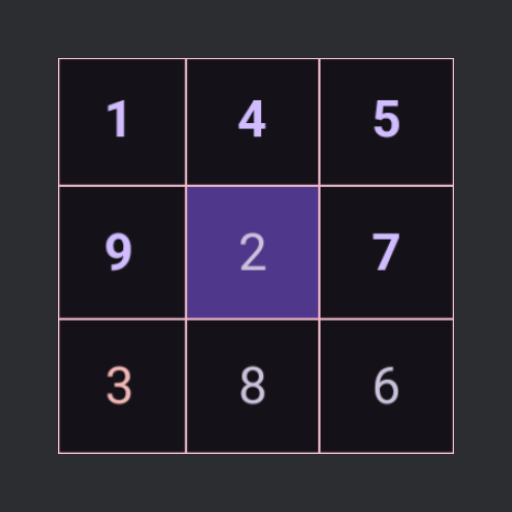
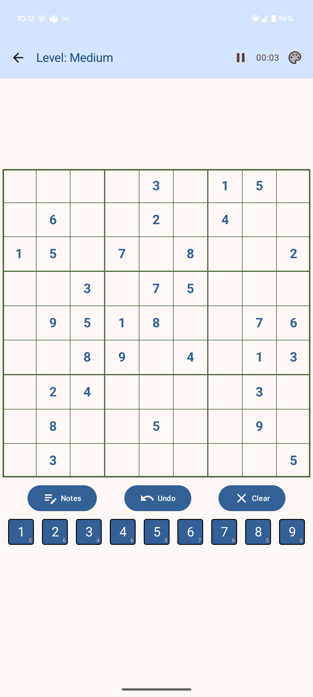
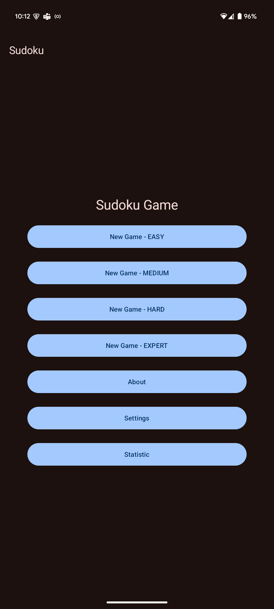

# Personal Sudoku

A classic Sudoku game for Android, built with Jetpack Compose.

|                Gameplay Screen                 |              Main Menu (Optional)               |
|:----------------------------------------------:|:-----------------------------------------------:|
|  |  |

---

## Features

*   Classic 9x9 Sudoku gameplay
*   Difficulty Levels: [Easy, Medium, Hard, Extreme]
*   Clean and Modern UI (Jetpack Compose)
*   Key Feature 1: Pencil Marks (Notes)
*   Key Feature 2: Error Highlighting
*   Key Feature 3: Light/Dark Theme
---

## Sonarcloud analysis
https://sonarcloud.io/project/overview?id=DmytroShulha_sudoku

## Tech Stack

*   **Language:** Kotlin
*   **UI:** Jetpack Compose
*   **Architecture:** MVVM
*   **Core Libraries:**
    *   ViewModel
    *   Navigation Compose
    *   Coroutines & Flow
    *   Data-Storage Preferences
---

## Getting Started

### Prerequisites

*   Android Studio [e.g., Iguana or newer]
*   Android SDK API [Your minSdk, e.g., 27]+

### Installation

1.  **Clone the repository:**
2.  **Open in Android Studio.**
3.  **Build and run the app.**

---

## How to Play

1.  Select a difficulty.
2.  Tap an empty cell, then tap a number from the keypad to place it.
3.  Fill the grid according to Sudoku rules (1-9 in each row, column, and 3x3 box).

---

## License

Distributed under the GPLv3.0 License.
https://www.gnu.org/licenses/gpl-3.0.en.html

---

**Author:** Dmytro Shulha - https://github.com/DmytroShulha